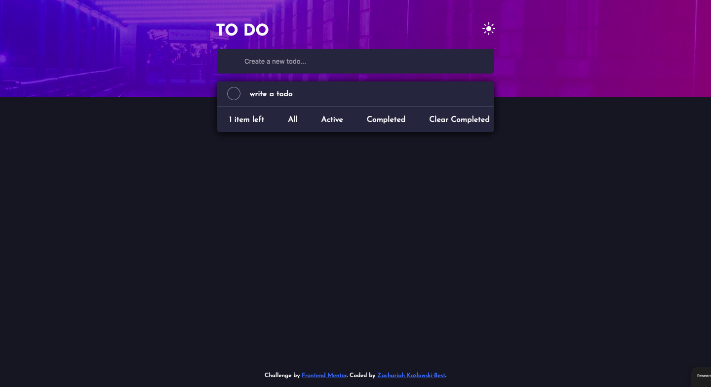
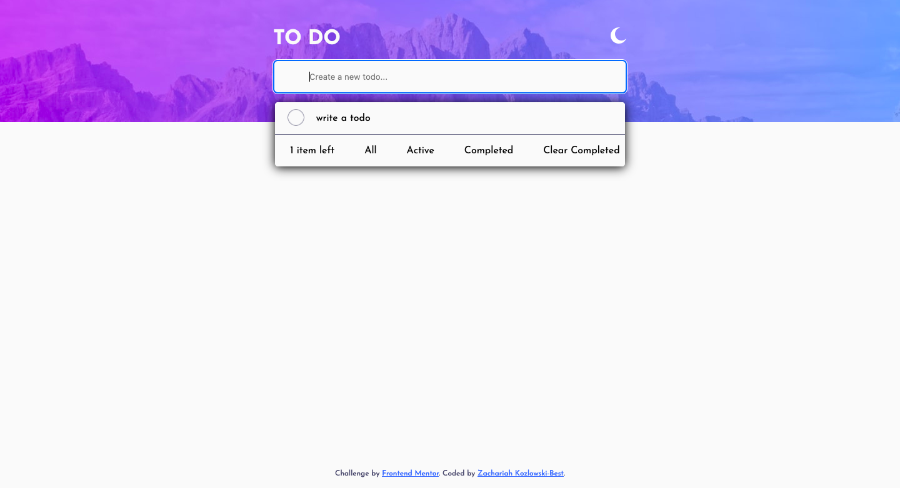
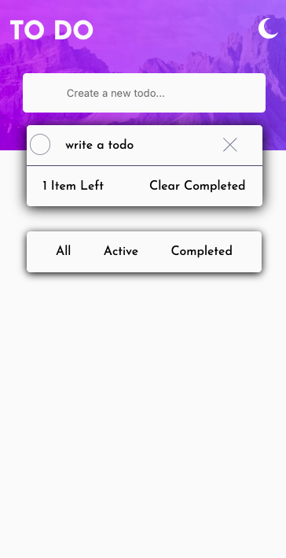
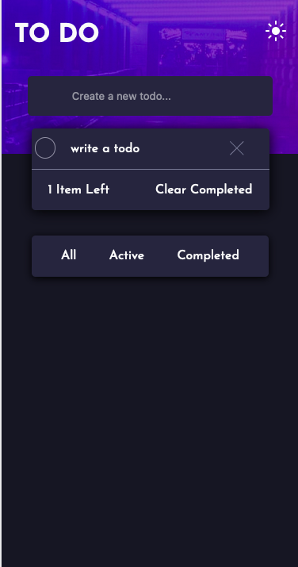

# Frontend Mentor - Todo app solution

This is a solution to the [Todo app challenge on Frontend Mentor](https://www.frontendmentor.io/challenges/todo-app-Su1_KokOW).

## Table of contents

- [Overview](#overview)
  - [The challenge](#the-challenge)
  - [Screenshot](#screenshot)
  - [Links](#links)
- [My process](#my-process)
  - [Built with](#built-with)
  - [What I learned](#what-i-learned)
  - [Continued development](#continued-development)
  - [Useful resources](#useful-resources)
- [Author](#author)
- [Acknowledgments](#acknowledgments)


## Overview
This is a full stack fully hosted toDo app that uses MongoDB as a database, react for a front end with node and express js for the backend.

### The challenge

Users should be able to:

- View the optimal layout for the app depending on their device's screen size
- See hover states for all interactive elements on the page
- Add new todos to the list
- Mark todos as complete
- Delete todos from the list
- Filter by all/active/complete todos
- Clear all completed todos
- Toggle light and dark mode

### Screenshot







### Links

- The Live Site [Live site](https://todo-app-frontend-obe0.onrender.com/)
- The front end respository used for hosting [github.com/zach7815/toDoList_backend](https://github.com/zach7815/toDo_list_frontend/)
- The back end respository used for hosting [github.com/zach7815/toDoList_backend](https://github.com/zach7815/toDolist_backend/)


## My process
I started the project by focussing on the front end, namely the mobile design and the SASS styling. I then focussed on getting the functionality to work. Then I moved onto the back end and working with Mongo DB.
### Built with

- Semantic HTML5 markup
- CSS custom properties
- Flexbox
- CSS Grid
- Mobile-first workflow
- [React](https://reactjs.org/)
- [Sass](https://sass-lang.com/)
- MongoDB
- Mongoose


### What I learned

In this project I practised and improved my understanding of React, React hooks. I also learnt how to use Sass. In addition I revisited and learnt the basics of MongoDB. Finally I learnt how to host a full stack site with a database for free.

To see how you can add code snippets, see below:


```Sass
@mixin circle(
$border-color:$dayLightGrayBlue,
$inputCircle:false
) {
  border-color: $border-color;
  height: 1.5em;
  width: 1.5em;
  border-style: solid;
  border-width: 1px;
  border-radius: 50%;


  @if $inputCircle {
    position:absolute;
  top:4.85rem;
  left:3rem;
  }
  @else{
    position: initial;
  cursor: pointer;
  }

}
```
```js
 <div className={`listContent ${darkMode===true?'darkmodeContent':'lightmodeContent'}`}>
```

I originally implemented the dark mode by having an custom react hook that used loads of class list toggles and was not very effective, it also didn't fully work with changing the images. I then found this method that allowed me to use state to more effectively change the background images  without errors.


### Continued development
Having done one full stack app, I am hoping to take on something more challenging. I am thinking of doing a version of a language learning app, namely a sentence re ordering app. As I have been learning chinese for a while so it will combine both my two passions. Though with the new app I am thinking of adding a 3rd person login as a feature and learning how to build a dashboard to record peoples progress.


### Useful resources

- [MongoDB connection Error](https://masteringjs.io/tutorials/mongoose/buffering-timed-out-after-10000ms) - One of my last problems was trying to get the live hosted back end to successfully connect with Mongo Atlas. I kept running into a Mongo connection timeout and my database wouldn't load.

- [CORS connection problem](https://www.stackhawk.com/blog/nodejs-cors-guide-what-it-is-and-how-to-enable-it/) - This is the second full stack project I have hosted and I have learnt how fun Cors is in trying to get two different domains to communicate and not be blocked by CORS. This article helped me troubleshoot what the problem was and get the site to work.

## Author

- Website - [Zach](https://zachkb.dev/)
- - [@zach7815](https://www.frontendmentor.io/profile/zach7815)
